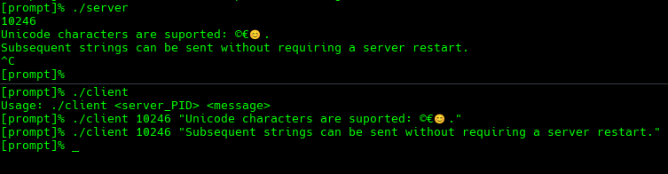

# Minitalk

Minitalk consists in creating a communication program between two processes using "SIGUSR1" and "SIGUSR2" UNIX signals.

## Project Overview


> 42 Madrid is an academy for values, attitude and learning "hard and soft skills" in the digital environment.
<br>
Minitalk is a project that focuses on inter-process communcation (IPC) using signals in Unix-based systems.

The goal is to create a client-server program where the client sends a message to the server, and the server receives and displays it, using only SIGUSR1 and SIGUSR2 UNIX signals for transmission.

- The project relies on SIGUSR1 and SIGUSR2 signals to transmit data between processes. Each bit of the message is represented by a specific signal: "SIGUSR1" is decoded as a 0, and "SIGUSR2" is decoded as a 1
- Since signals are used to send individual bits, bitwise operations are essential to encode and decode the message
- This project follows a client-server architecture: the server runs in the background, waiting for signals from the client. The client sends a message to the server by converting it into a sequence of bits and sending the corresponding signals
- The client needs to know the server's PID to send signals to it
- Proper error handling is crucial, especially for signal handling, process management, and ensuring the message is transmitted correctly

## Run

Clone the repository and run the following make targets:

```bash
git clone https://github.com/JohnnyCPP/42_minitalk.git
cd 42_minitalk
make help
make all
./server
# the PID will be displayed, then, run the client
./client <pid> <message>
# to build the bonus version of both programs
make bonus
```

As an example, an execution lifecycle could look like the following screenshot:

