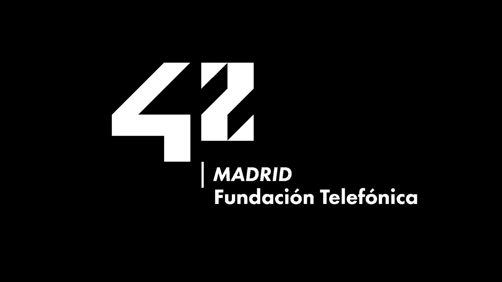

# Minitalk

Minitalk consists in creating a communication program between two processes using "SIGUSR1" and "SIGUSR2" UNIX signals.

## Project Overview

> 42 Madrid is an academy for values, attitude and learning "hard and soft skills" in the digital environment.
 
This project is work-in-progress.
